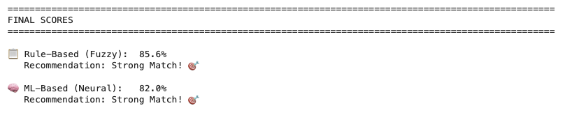
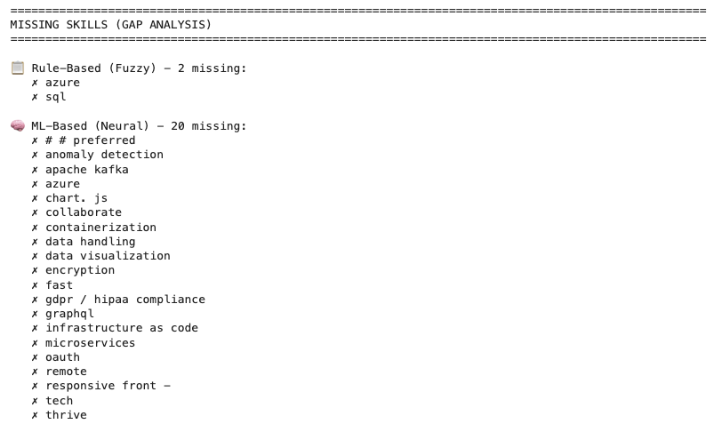

# Resume–Job Description Matching (NLP Project)

This project uses Natural Language Processing (NLP) to **extract skills from resumes**, compare them to **job descriptions**, and compute a **match score** that helps candidates understand how well they align with a role.

The goal is to build a reusable pipeline that:
- Processes raw text from resumes and job postings
- Identifies key skills and relevant information
- Measures how closely a given resume matches a specific job description

---

## 🔍 Project Overview

**Core objectives:**

1. Parse and clean resume and job description text  
2. Extract skills and relevant keywords  
3. Convert text into numerical features suitable for modeling  
4. Compare resume vs job description and generate:
   - Extracted skills
   - Match analysis
   - Alignment score / insights

---

## 🧠 Model / NLP Pipeline

Typical steps in the pipeline include:

- Text cleaning (lowercasing, removing noise, etc.)  
- Tokenization and vocabulary building  
- Feature extraction (e.g., TF–IDF or embeddings)  
- Model training for skill/relevance detection  
- Inference pipeline for resume–job matching

The main dataset is:

- `UpdatedResumeDataSet.csv` – a collection of resume-like text entries used to train and evaluate the model.

---

## 📂 Repository Structure

```text
resume-job-matching-nlp/
│
├─ notebooks/
│   ├─ 01_training.ipynb          # End-to-end model training workflow
│   └─ 02_inference_demo.ipynb    # Demo: upload resume + job description and get a match result
│
├─ models/
│   └─ saved_models/              # Trained model, vocab, and related artifacts
│
├─ data/
│   └─ UpdatedResumeDataSet.csv   # Placeholder for dataset (not committed if private)
│
└─ README.md

## Example Output

The system compares a resume and job description using multiple similarity signals and produces a final match score along with a skill gap analysis.

### Final Match Scores


### Skill Gap Analysis


**Notes:**
- Gap analysis highlights skills not explicitly surfaced in the resume text, not necessarily lack of knowledge.
- This mirrors real ATS behavior and helps identify opportunities for resume optimization.

